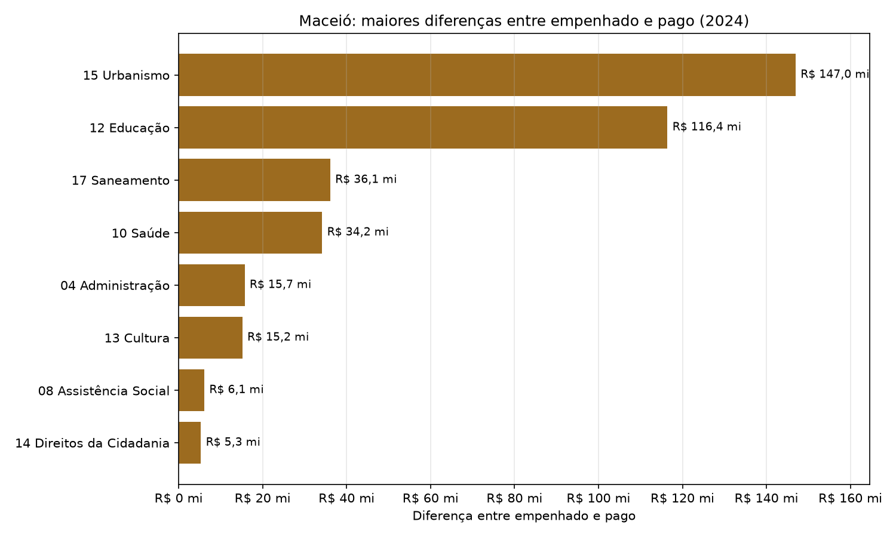
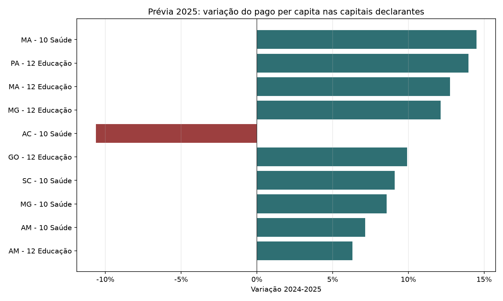

# Análise FINBRA - Despesas por Função

## Método

A leitura respeita o formato brasileiro dos CSVs do Siconfi: `latin-1`, separador `;`,
3 linhas iniciais ignoradas e decimal com vírgula. As análises por função usam apenas
linhas classificadas como `funcao`, evitando dupla contagem com totais agregados,
subfunções e `FUxx - Demais Subfunções`.

Foram identificadas 50.334 linhas na base consolidada. Destas, 37.521
linhas não são funções e ficam fora dos rankings por função.

Também foi gerado um dashboard visual em `relatorios/analise_finbra.html`, com estilos em
`relatorios/dashboard.css`, para uma leitura mais confortável dos resultados.

## Completude por ano

| Ano | Capitais | Status |
| --- | --- | --- |
| 2020 | 26 | completo |
| 2021 | 26 | completo |
| 2022 | 26 | completo |
| 2023 | 26 | completo |
| 2024 | 26 | completo |
| 2025 | 11 | incompleto |

Os anos completos para comparação histórica são 2020, 2021, 2022, 2023, 2024. O ano de 2025 está incompleto e não foi usado nas comparações históricas principais.

## Rankings de Saúde e Educação em 2024

| Função | Capital | Pago per capita | Taxa de execução |
| --- | --- | --- | --- |
| 10 - Saúde | Belo Horizonte - MG | R$ 2.253,18 | 89,9% |
| 10 - Saúde | Teresina - PI | R$ 2.003,49 | 96,7% |
| 10 - Saúde | Campo Grande - MS | R$ 1.858,04 | 88,2% |
| 10 - Saúde | São Paulo - SP | R$ 1.791,32 | 96,1% |
| 10 - Saúde | Porto Alegre - RS | R$ 1.739,84 | 87,3% |
| 12 - Educação | Vitória - ES | R$ 2.232,14 | 91,9% |
| 12 - Educação | São Paulo - SP | R$ 1.827,98 | 95,8% |
| 12 - Educação | Palmas - TO | R$ 1.809,99 | 97,9% |
| 12 - Educação | Boa Vista - RR | R$ 1.611,01 | 97,2% |
| 12 - Educação | Florianópolis - SC | R$ 1.464,21 | 96,1% |

## Maiores diferenças entre empenhado e pago em 2024

| Capital | Função | Empenhado | Pago | Diferença | Taxa de execução |
| --- | --- | --- | --- | --- | --- |
| São Paulo - SP | 15 - Urbanismo | R$ 12.071.750.665,81 | R$ 10.203.722.086,42 | R$ 1.868.028.579,39 | 84,5% |
| São Paulo - SP | 12 - Educação | R$ 23.290.435.795,57 | R$ 22.301.640.088,44 | R$ 988.795.707,13 | 95,8% |
| São Paulo - SP | 10 - Saúde | R$ 22.752.837.820,49 | R$ 21.854.464.654,11 | R$ 898.373.166,38 | 96,1% |
| São Paulo - SP | 17 - Saneamento | R$ 2.868.478.794,47 | R$ 2.022.166.546,08 | R$ 846.312.248,39 | 70,5% |
| Curitiba - PR | 15 - Urbanismo | R$ 1.805.830.695,76 | R$ 982.059.804,58 | R$ 823.770.891,18 | 54,4% |
| Rio de Janeiro - RJ | 12 - Educação | R$ 7.151.238.932,58 | R$ 6.475.560.709,52 | R$ 675.678.223,06 | 90,6% |
| Belo Horizonte - MG | 10 - Saúde | R$ 5.993.532.028,34 | R$ 5.391.129.586,40 | R$ 602.402.441,94 | 89,9% |
| Rio de Janeiro - RJ | 10 - Saúde | R$ 7.642.644.288,09 | R$ 7.093.295.406,04 | R$ 549.348.882,05 | 92,8% |
| Rio de Janeiro - RJ | 09 - Previdência Social | R$ 6.789.834.775,46 | R$ 6.260.036.852,91 | R$ 529.797.922,55 | 92,2% |
| São Paulo - SP | 16 - Habitação | R$ 5.281.552.995,13 | R$ 4.760.425.320,14 | R$ 521.127.674,99 | 90,1% |

## Baixa execução financeira em 2024

O recorte abaixo considera funções com pelo menos R$ 1.000.000,00 em despesas empenhadas, para evitar que valores residuais dominem a leitura.

| Capital | Função | Empenhado | Pago | Taxa de execução |
| --- | --- | --- | --- | --- |
| Goiânia - GO | 11 - Trabalho | R$ 1.293.451,03 | R$ 0,00 | 0,0% |
| São Luís - MA | 23 - Comércio e Serviços | R$ 1.867.305,91 | R$ 559.164,13 | 29,9% |
| Maceió - AL | 16 - Habitação | R$ 2.168.153,21 | R$ 649.674,84 | 30,0% |
| Teresina - PI | 17 - Saneamento | R$ 4.825.482,62 | R$ 1.586.615,17 | 32,9% |
| Teresina - PI | 18 - Gestão Ambiental | R$ 3.913.655,20 | R$ 1.576.162,65 | 40,3% |
| Curitiba - PR | 16 - Habitação | R$ 47.450.518,60 | R$ 21.807.627,41 | 46,0% |
| Vitória - ES | 23 - Comércio e Serviços | R$ 15.739.115,51 | R$ 7.804.478,54 | 49,6% |
| São Luís - MA | 20 - Agricultura | R$ 4.555.374,74 | R$ 2.291.631,27 | 50,3% |
| Vitória - ES | 24 - Comunicações | R$ 9.937.871,45 | R$ 5.091.425,60 | 51,2% |
| Curitiba - PR | 15 - Urbanismo | R$ 1.805.830.695,76 | R$ 982.059.804,58 | 54,4% |

Tabela auxiliar: `relatorios/baixa_execucao_2024.csv`.

## Restos a pagar sobre empenhado em 2024

| Capital | Função | Empenhado | Restos a pagar | Restos sobre empenhado | Taxa de execução |
| --- | --- | --- | --- | --- | --- |
| Goiânia - GO | 11 - Trabalho | R$ 1.293.451,03 | R$ 1.293.451,03 | 100,0% | 0,0% |
| São Luís - MA | 23 - Comércio e Serviços | R$ 1.867.305,91 | R$ 1.308.141,78 | 70,1% | 29,9% |
| Maceió - AL | 16 - Habitação | R$ 2.168.153,21 | R$ 1.518.478,37 | 70,0% | 30,0% |
| Teresina - PI | 17 - Saneamento | R$ 4.825.482,62 | R$ 3.238.867,45 | 67,1% | 32,9% |
| Teresina - PI | 18 - Gestão Ambiental | R$ 3.913.655,20 | R$ 2.337.492,55 | 59,7% | 40,3% |
| Curitiba - PR | 16 - Habitação | R$ 47.450.518,60 | R$ 25.642.891,19 | 54,0% | 46,0% |
| Vitória - ES | 23 - Comércio e Serviços | R$ 15.739.115,51 | R$ 7.934.636,97 | 50,4% | 49,6% |
| São Luís - MA | 20 - Agricultura | R$ 4.555.374,74 | R$ 2.263.743,47 | 49,7% | 50,3% |
| Vitória - ES | 24 - Comunicações | R$ 9.937.871,45 | R$ 4.846.445,85 | 48,8% | 51,2% |
| Curitiba - PR | 15 - Urbanismo | R$ 1.805.830.695,76 | R$ 823.770.891,18 | 45,6% | 54,4% |

Tabela auxiliar: `relatorios/restos_a_pagar_2024.csv`.

## Maceió contra distribuição das capitais

| Ano | Função | Maceió pago pc | Média pago pc | Mediana pago pc | Posição pago pc | Maceió execução | Mediana execução |
| --- | --- | --- | --- | --- | --- | --- | --- |
| 2020 | 10 - Saúde | R$ 766,94 | R$ 881,20 | R$ 789,72 | 15º de 26 | 98,7% | 93,4% |
| 2020 | 12 - Educação | R$ 313,16 | R$ 617,60 | R$ 592,54 | 24º de 26 | 89,2% | 95,7% |
| 2021 | 10 - Saúde | R$ 737,29 | R$ 939,08 | R$ 854,60 | 18º de 26 | 97,7% | 94,5% |
| 2021 | 12 - Educação | R$ 375,40 | R$ 659,03 | R$ 614,40 | 24º de 26 | 82,9% | 85,3% |
| 2022 | 10 - Saúde | R$ 832,41 | R$ 997,61 | R$ 900,50 | 18º de 26 | 98,4% | 92,9% |
| 2022 | 12 - Educação | R$ 702,25 | R$ 835,78 | R$ 793,89 | 16º de 26 | 94,3% | 90,2% |
| 2023 | 10 - Saúde | R$ 1.235,46 | R$ 1.158,78 | R$ 1.068,33 | 9º de 26 | 97,8% | 93,2% |
| 2023 | 12 - Educação | R$ 593,80 | R$ 957,60 | R$ 906,74 | 24º de 26 | 94,4% | 91,8% |
| 2024 | 10 - Saúde | R$ 1.314,67 | R$ 1.348,42 | R$ 1.296,56 | 13º de 26 | 97,4% | 95,5% |
| 2024 | 12 - Educação | R$ 715,71 | R$ 1.158,05 | R$ 1.055,80 | 25º de 26 | 85,5% | 94,3% |

Tabela auxiliar: `relatorios/maceio_distribuicao_capitais.csv`.

## Subfunções de Saúde e Educação em Maceió (2024)

| Função | Subfunção | Pago | Pago per capita | Participação na função | Taxa de execução |
| --- | --- | --- | --- | --- | --- |
| Saúde | 10.302 - Assistência Hospitalar e Ambulatorial | R$ 739.098.739,88 | R$ 769,36 | 58,5% | 96,6% |
| Saúde | 10.301 - Atenção Básica | R$ 346.872.424,92 | R$ 361,07 | 27,5% | 99,0% |
| Saúde | 10.122 - Administração Geral | R$ 77.189.022,44 | R$ 80,35 | 6,1% | 98,8% |
| Saúde | 10.305 - Vigilância Epidemiológica | R$ 68.567.166,70 | R$ 71,37 | 5,4% | 98,5% |
| Saúde | 10.303 - Suporte Profilático e Terapêutico | R$ 22.785.057,90 | R$ 23,72 | 1,8% | 91,0% |
| Saúde | 10.304 - Vigilância Sanitária | R$ 8.141.131,48 | R$ 8,47 | 0,6% | 99,1% |
| Educação | 12.361 - Ensino Fundamental | R$ 291.273.033,05 | R$ 303,20 | 42,7% | 97,3% |
| Educação | 12.122 - Administração Geral | R$ 193.550.273,99 | R$ 201,47 | 28,4% | 82,2% |
| Educação | 12.368 - Educação Básica | R$ 141.609.400,11 | R$ 147,41 | 20,8% | 69,3% |
| Educação | 12.365 - Educação Infantil | R$ 50.237.143,03 | R$ 52,29 | 7,4% | 96,6% |
| Educação | 12.367 - Educação Especial | R$ 3.440.711,17 | R$ 3,58 | 0,5% | 100,0% |
| Educação | 12.366 - Educação de Jovens e Adultos | R$ 1.239.541,75 | R$ 1,29 | 0,2% | 100,0% |

Tabela auxiliar: `relatorios/subfuncoes_maceio_2024.csv`.

## Taxas de execução acima de 100%

Algumas funções aparecem com despesas pagas maiores que as empenhadas no mesmo ano. Isso não deve ser lido automaticamente como erro: pode refletir pagamentos de restos de exercícios anteriores ou outras dinâmicas contábeis. O ponto é tratar esses casos como alerta interpretativo antes de comparar rankings.

| Ano | Capital | Função | Empenhado | Pago | Taxa de execução |
| --- | --- | --- | --- | --- | --- |
| 2023 | Porto Velho - RO | 28 - Encargos Especiais | R$ 131.804.487,40 | R$ 147.921.326,16 | 112,2% |
| 2023 | Porto Velho - RO | 12 - Educação | R$ 509.360.652,26 | R$ 534.101.559,80 | 104,9% |
| 2023 | Porto Velho - RO | 10 - Saúde | R$ 543.437.924,51 | R$ 562.515.234,52 | 103,5% |
| 2023 | Porto Velho - RO | 01 - Legislativa | R$ 53.534.311,19 | R$ 54.081.483,38 | 101,0% |
| 2024 | Aracaju - SE | 28 - Encargos Especiais | R$ 201.673.513,30 | R$ 203.509.021,88 | 100,9% |
| 2023 | Porto Velho - RO | 13 - Cultura | R$ 6.763.523,77 | R$ 6.784.093,32 | 100,3% |
| 2023 | Porto Velho - RO | 04 - Administração | R$ 518.606.400,05 | R$ 520.026.750,93 | 100,3% |
| 2023 | Porto Velho - RO | 09 - Previdência Social | R$ 187.765.021,82 | R$ 188.197.135,78 | 100,2% |
| 2024 | Belém - PA | 01 - Legislativa | R$ 132.409.889,76 | R$ 132.460.145,70 | 100,0% |

Tabela auxiliar: `relatorios/taxas_execucao_acima_100.csv`.

## Maceió contra média das capitais

| Ano | Função | Maceió execução | Média execução | Maceió pago per capita | Média pago per capita |
| --- | --- | --- | --- | --- | --- |
| 2020 | 10 - Saúde | 98,7% | 92,9% | R$ 766,94 | R$ 881,20 |
| 2020 | 12 - Educação | 89,2% | 93,5% | R$ 313,16 | R$ 617,60 |
| 2021 | 10 - Saúde | 97,7% | 92,7% | R$ 737,29 | R$ 939,08 |
| 2021 | 12 - Educação | 82,9% | 85,5% | R$ 375,40 | R$ 659,03 |
| 2022 | 10 - Saúde | 98,4% | 92,2% | R$ 832,41 | R$ 997,61 |
| 2022 | 12 - Educação | 94,3% | 88,0% | R$ 702,25 | R$ 835,78 |
| 2023 | 10 - Saúde | 97,8% | 93,3% | R$ 1.235,46 | R$ 1.158,78 |
| 2023 | 12 - Educação | 94,4% | 91,3% | R$ 593,80 | R$ 957,60 |
| 2024 | 10 - Saúde | 97,4% | 94,2% | R$ 1.314,67 | R$ 1.348,42 |
| 2024 | 12 - Educação | 85,5% | 92,9% | R$ 715,71 | R$ 1.158,05 |

## Prévia de 2025: capitais declarantes

Como 2025 tem apenas parte das capitais declaradas, este recorte não é comparado com o conjunto completo de capitais. Para aproveitar o dado sem distorcer a leitura, a comparação temporal usa somente as capitais que aparecem em 2025.

| UF | Capital declarante |
| --- | --- |
| AC | Rio Branco - AC |
| AM | Manaus - AM |
| BA | Salvador - BA |
| CE | Fortaleza - CE |
| GO | Goiânia - GO |
| MA | São Luís - MA |
| MG | Belo Horizonte - MG |
| PA | Belém - PA |
| RJ | Rio de Janeiro - RJ |
| RO | Porto Velho - RO |
| SC | Florianópolis - SC |

### Ranking preliminar de Saúde e Educação em 2025

| Função | Capital | Pago per capita | Taxa de execução |
| --- | --- | --- | --- |
| 10 - Saúde | Belo Horizonte - MG | R$ 2.445,94 | 88,6% |
| 10 - Saúde | Goiânia - GO | R$ 1.476,87 | 98,4% |
| 10 - Saúde | São Luís - MA | R$ 1.392,67 | 92,5% |
| 10 - Saúde | Fortaleza - CE | R$ 1.370,73 | 98,7% |
| 10 - Saúde | Porto Velho - RO | R$ 1.263,68 | 94,9% |
| 12 - Educação | Florianópolis - SC | R$ 1.437,60 | 93,1% |
| 12 - Educação | Belo Horizonte - MG | R$ 1.416,70 | 91,6% |
| 12 - Educação | Manaus - AM | R$ 1.378,62 | 98,5% |
| 12 - Educação | Goiânia - GO | R$ 1.334,41 | 94,6% |
| 12 - Educação | Porto Velho - RO | R$ 1.286,46 | 97,2% |

### Painel balanceado: 2024 vs 2025 nas mesmas capitais

| Capital | Função | Pago pc 2024 | Pago pc 2025 | Variação pago pc | Execução 2024 | Execução 2025 |
| --- | --- | --- | --- | --- | --- | --- |
| São Luís - MA | 10 - Saúde | R$ 1.216,39 | R$ 1.392,67 | 14,5% | 89,5% | 92,5% |
| Belém - PA | 12 - Educação | R$ 629,19 | R$ 717,03 | 14,0% | 95,1% | 89,0% |
| São Luís - MA | 12 - Educação | R$ 958,68 | R$ 1.080,91 | 12,7% | 78,6% | 77,4% |
| Belo Horizonte - MG | 12 - Educação | R$ 1.263,57 | R$ 1.416,70 | 12,1% | 90,3% | 91,6% |
| Rio Branco - AC | 10 - Saúde | R$ 864,56 | R$ 772,66 | -10,6% | 97,1% | 93,4% |
| Goiânia - GO | 12 - Educação | R$ 1.213,97 | R$ 1.334,41 | 9,9% | 94,0% | 94,6% |
| Florianópolis - SC | 10 - Saúde | R$ 958,08 | R$ 1.045,20 | 9,1% | 91,9% | 91,7% |
| Belo Horizonte - MG | 10 - Saúde | R$ 2.253,18 | R$ 2.445,94 | 8,6% | 89,9% | 88,6% |
| Manaus - AM | 10 - Saúde | R$ 797,01 | R$ 854,07 | 7,2% | 95,4% | 97,0% |
| Manaus - AM | 12 - Educação | R$ 1.296,83 | R$ 1.378,62 | 6,3% | 98,4% | 98,5% |

## Gráficos

## Conclusões principais

- A comparação anual deve priorizar 2020 a 2024, pois 2025 tem apenas parte das capitais declaradas.
- A prévia de 2025 só compara capitais declarantes contra elas mesmas em 2024.
- Em 2024, Maceió combina alta execução em Saúde com diferenças mais relevantes entre empenhado e pago em Urbanismo e Educação.
- O detalhamento por subfunção mostra que Saúde se concentra em assistência hospitalar e atenção básica, enquanto Educação se concentra em ensino fundamental, administração geral e educação básica.
- Restos a pagar e taxas acima de 100% precisam ser lidos como sinais de dinâmica orçamentária, não apenas como ranking simples.
- Os rankings por função excluem agregados para evitar dupla contagem.
- A leitura per capita é essencial para comparar capitais de portes muito diferentes.
