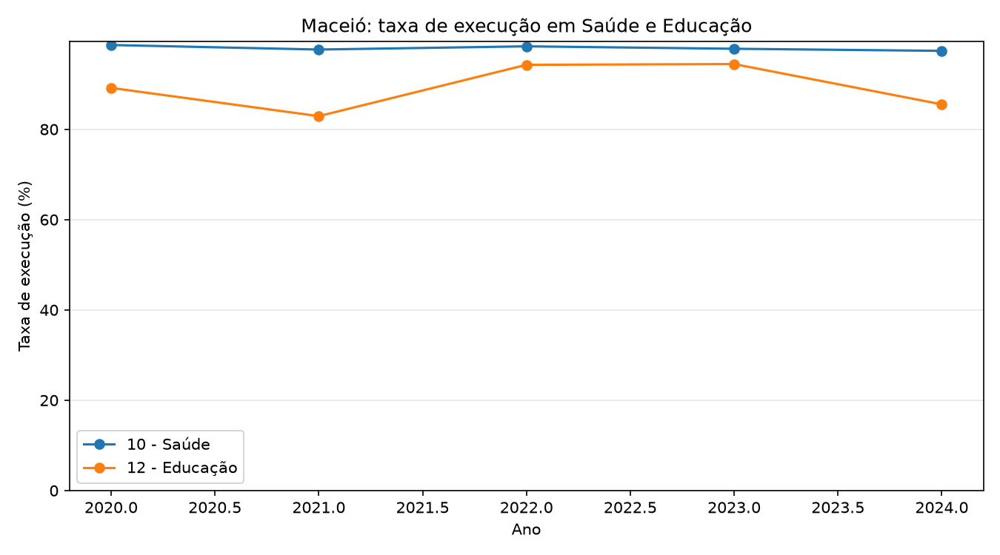
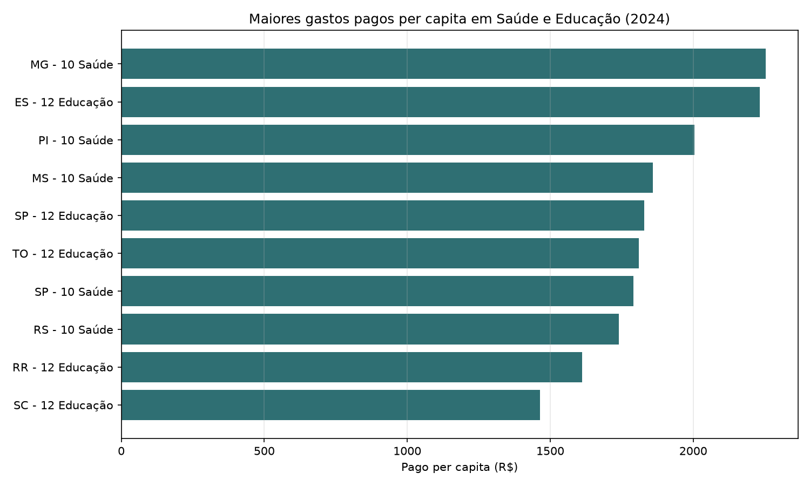

# Análise FINBRA - Despesas por Função

## Método

A leitura respeita o formato brasileiro dos CSVs do Siconfi: `latin-1`, separador `;`,
3 linhas iniciais ignoradas e decimal com vírgula. As análises por função usam apenas
linhas classificadas como `funcao`, evitando dupla contagem com totais agregados,
subfunções e `FUxx - Demais Subfunções`.

Foram identificadas 50.334 linhas na base consolidada. Destas, 37.521
linhas não são funções e ficam fora dos rankings por função.

## Completude por ano

| Ano | Capitais | Status |
| --- | --- | --- |
| 2020 | 26 | completo |
| 2021 | 26 | completo |
| 2022 | 26 | completo |
| 2023 | 26 | completo |
| 2024 | 26 | completo |
| 2025 | 11 | incompleto |

Os anos completos para comparação histórica são 2020, 2021, 2022, 2023, 2024. O ano de 2025 está incompleto e não foi usado nas comparações históricas principais.

## Rankings de Saúde e Educação em 2024

| Função | Capital | Pago per capita | Taxa de execução |
| --- | --- | --- | --- |
| 10 - Saúde | Belo Horizonte - MG | R$ 2.253,18 | 89,9% |
| 10 - Saúde | Teresina - PI | R$ 2.003,49 | 96,7% |
| 10 - Saúde | Campo Grande - MS | R$ 1.858,04 | 88,2% |
| 10 - Saúde | São Paulo - SP | R$ 1.791,32 | 96,1% |
| 10 - Saúde | Porto Alegre - RS | R$ 1.739,84 | 87,3% |
| 12 - Educação | Vitória - ES | R$ 2.232,14 | 91,9% |
| 12 - Educação | São Paulo - SP | R$ 1.827,98 | 95,8% |
| 12 - Educação | Palmas - TO | R$ 1.809,99 | 97,9% |
| 12 - Educação | Boa Vista - RR | R$ 1.611,01 | 97,2% |
| 12 - Educação | Florianópolis - SC | R$ 1.464,21 | 96,1% |

## Maiores diferenças entre empenhado e pago em 2024

| Capital | Função | Empenhado | Pago | Diferença | Taxa de execução |
| --- | --- | --- | --- | --- | --- |
| São Paulo - SP | 15 - Urbanismo | R$ 12.071.750.665,81 | R$ 10.203.722.086,42 | R$ 1.868.028.579,39 | 84,5% |
| São Paulo - SP | 12 - Educação | R$ 23.290.435.795,57 | R$ 22.301.640.088,44 | R$ 988.795.707,13 | 95,8% |
| São Paulo - SP | 10 - Saúde | R$ 22.752.837.820,49 | R$ 21.854.464.654,11 | R$ 898.373.166,38 | 96,1% |
| São Paulo - SP | 17 - Saneamento | R$ 2.868.478.794,47 | R$ 2.022.166.546,08 | R$ 846.312.248,39 | 70,5% |
| Curitiba - PR | 15 - Urbanismo | R$ 1.805.830.695,76 | R$ 982.059.804,58 | R$ 823.770.891,18 | 54,4% |
| Rio de Janeiro - RJ | 12 - Educação | R$ 7.151.238.932,58 | R$ 6.475.560.709,52 | R$ 675.678.223,06 | 90,6% |
| Belo Horizonte - MG | 10 - Saúde | R$ 5.993.532.028,34 | R$ 5.391.129.586,40 | R$ 602.402.441,94 | 89,9% |
| Rio de Janeiro - RJ | 10 - Saúde | R$ 7.642.644.288,09 | R$ 7.093.295.406,04 | R$ 549.348.882,05 | 92,8% |
| Rio de Janeiro - RJ | 09 - Previdência Social | R$ 6.789.834.775,46 | R$ 6.260.036.852,91 | R$ 529.797.922,55 | 92,2% |
| São Paulo - SP | 16 - Habitação | R$ 5.281.552.995,13 | R$ 4.760.425.320,14 | R$ 521.127.674,99 | 90,1% |

## Maceió contra média das capitais

| Ano | Função | Maceió execução | Média execução | Maceió pago per capita | Média pago per capita |
| --- | --- | --- | --- | --- | --- |
| 2020 | 10 - Saúde | 98,7% | 92,9% | R$ 766,94 | R$ 881,20 |
| 2020 | 12 - Educação | 89,2% | 93,5% | R$ 313,16 | R$ 617,60 |
| 2021 | 10 - Saúde | 97,7% | 92,7% | R$ 737,29 | R$ 939,08 |
| 2021 | 12 - Educação | 82,9% | 85,5% | R$ 375,40 | R$ 659,03 |
| 2022 | 10 - Saúde | 98,4% | 92,2% | R$ 832,41 | R$ 997,61 |
| 2022 | 12 - Educação | 94,3% | 88,0% | R$ 702,25 | R$ 835,78 |
| 2023 | 10 - Saúde | 97,8% | 93,3% | R$ 1.235,46 | R$ 1.158,78 |
| 2023 | 12 - Educação | 94,4% | 91,3% | R$ 593,80 | R$ 957,60 |
| 2024 | 10 - Saúde | 97,4% | 94,2% | R$ 1.314,67 | R$ 1.348,42 |
| 2024 | 12 - Educação | 85,5% | 92,9% | R$ 715,71 | R$ 1.158,05 |

## Gráficos

## Conclusões principais

- A comparação anual deve priorizar 2020 a 2024, pois 2025 tem apenas parte das capitais declaradas.
- A taxa de execução financeira mostra a distância entre o gasto comprometido e o efetivamente pago.
- Os rankings por função excluem agregados para evitar dupla contagem.
- A leitura per capita é essencial para comparar capitais de portes muito diferentes.
